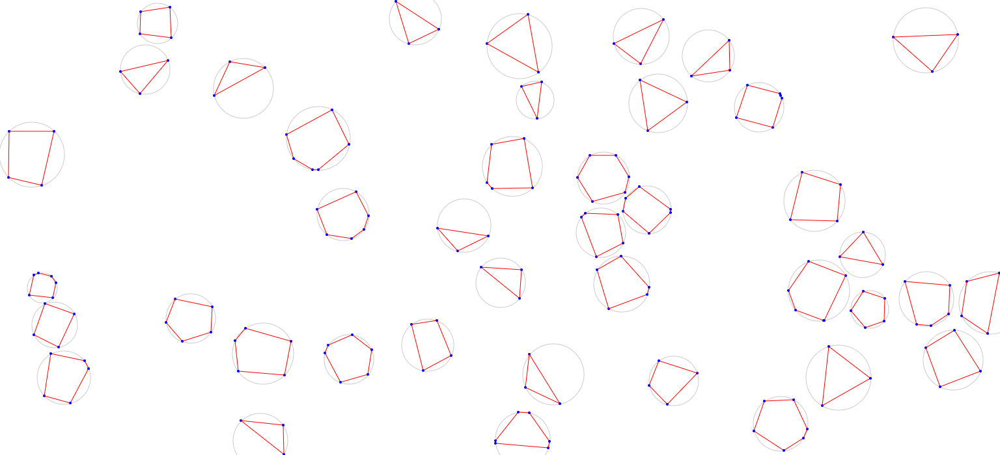

# Random Convex Polygon Field Generators

- Free as in speech
- Small API, easy to use

These scripts, in Java and JavaScript, allow the user to generate the coordinates of a 2D plane of randomly placed, randomly shaped convex polygons.

See the readme in each language folder to learn more about the specific implementations.

Sample output:

